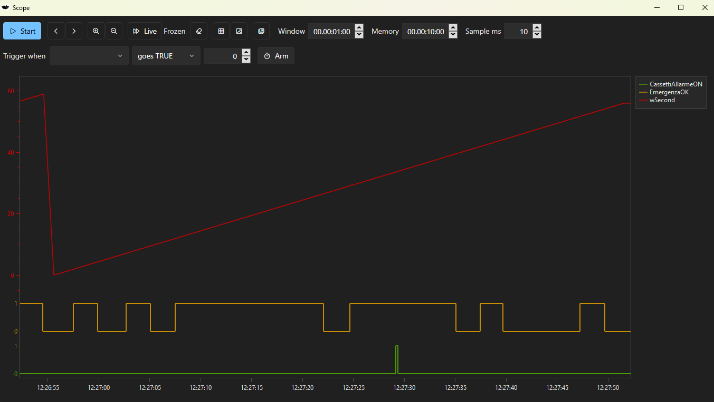

#  TwinCatAdsTool

A fork of [fbarresi/TwinCatAdsTool](https://github.com/fbarresi/TwinCatAdsTool) — the TwinCAT tool
you ever wanted and your lite alternative to Visual Studio.

This fork fixes several defects in the persistent variable backup and restore engine, two of which
could lose data without saying so, adds a command line so a backup can be automated, turns the live
value graph into a scope that can be stopped and scrolled through, and modernises the application: .NET 8, ADS 7 (one binary for TwinCAT 4024 and
4026) and a Fluent interface.

Everything below is either measured on a real plant or stated as unverified. Where a claim rests on
a measurement, the numbers are given.


Dark by default, with a light theme a click away — the *Theme* button at the foot of the navigation
panel switches between the two without a restart, and the choice is remembered. The shot is of the
backup tab; the explore tab is [further down](#the-explore-tab-is-now-a-scope).

---

## Why this fork exists

The first restore attempted against a real PLC reported success and had written only part of the
data. Chasing that down turned up a chain of defects, each hidden behind the previous one, all of
them present in the original code.

The list matters more than the fork: **anyone who has used this tool to restore structured
persistent variables may have a plant that is only partly configured, with no error to show for
it.**

### 1. Restore never wrote structures at all

`IValueSymbol.ReadValueAsync` returns a *result object*, not the value:

```csharp
Task<ResultReadValueAccess> ReadValueAsync(CancellationToken cancel);
```

The writer passed that wrapper straight into the conversion layer, which accepts `object`, so the
compiler had nothing to say. Inside, the cast to `DynamicValue` produced `null`: no members, no
elements, every structure and array treated as a scalar. The restore then reported

```
GVL.PersVarGlobalUser1_1: failed - backup value '' does not fit the plc type
```

for every structured variable. The signature is identical in the 5.x line of the ADS library, so
this defect predates any change made here.

`WriteValueAsync` returns a result too, and its `Succeeded` flag was ignored outright: a write the
PLC refused was counted as a write that worked.

### 2. Values below the first level were written to a copy and lost

This is the serious one, because it reported success.

When the ADS library enters a struct member or an array element, it hands out a **copy** of the
buffer, not a view (`DynamicValueFactory.CreateValue` calls `sourceData.ToArray()`). The old engine
read a whole variable, changed the value tree in memory and wrote the variable back. Anything
written into a nested branch went into a copy nobody ever sent to the PLC — and
`TrySetMemberValue` returns `true` without doing anything for a member that is not primitive, so
nothing failed.

Measured on a live PLC. A backup taken before the restore, and one taken after, with the restore
asking for seven values:

| Variable | Before | Asked for | After | |
|---|---|---|---|---|
| `PersVarGlobalArray` | `[6,7,8,0]` | `[11,22,33,44]` | `[11,22,33,44]` | written |
| `PersVarGlobalUser1_1.Int1` | 157 | 1001 | 1001 | written |
| `.Int2` | 168 | 1002 | 1002 | written |
| `.Bool1` `.Bool2` `.Bool3` | true, true, false | false, false, true | false, false, true | written |
| `.InInVar.IntInIn1` | 12 | **9999** | **12** | **lost** |
| `.InInVar.RealInIn1` | 123.2345 | **999.5** | **123.2345** | **lost** |

The tool reported the whole variable as written.

The boundary is not "arrays work, structures do not": the array of `INT` at the root was written.
What is lost is **everything reached by passing through a non primitive child**.

**The fix.** The engine no longer modifies the value it read in order to write it back.
`PlcLeafPlanner` works out which individual leaves the backup wants written, and each one is
written **to the symbol that owns it**, grouped into sum commands. The value that was read is only
consulted, to learn the declared type of each leaf. The copy is gone from the path rather than
worked around.

Two things fall out of this. The report now names the leaf — `GVL.Var.InInVar.IntInIn1: ads error
...` instead of just the variable — and array elements are addressed **by position** among the
child symbols rather than by a computed index, which removes the `Dimensions mismatch!` failure on
multidimensional arrays in the write path.

The planner is a pure function, so the whole thing is testable without a PLC:
`Tests/TwinCatAdsTool.Logic.Tests/PlcLeafPlannerTests.cs`.

### 3. Structures came back from the PLC as raw bytes

The first backup taken against a real PLC serialised a `User1DUT` as twenty numbers:

```json
"PersVarGlobalUser1_1": [157, 0, 168, 0, 1, 0, 0, 0, 12, 0, 0, 0, 16, 120, 246, 66, 1, 0, 0, 0]
```

The data was all there — `16,120,246,66` is `123.2345` as a little endian REAL — but the shape was
gone, and the report still said `20 ok, 0 failed`.

The symbols were being loaded with `SymbolsLoadMode.VirtualTree`, which hands a STRUCT back as
`byte[]`. Only `SymbolsLoadMode.DynamicTree` produces a `DynamicValue` whose members can be walked.
Verified by reading the same symbol both ways:

| Load mode | Type of the value |
|---|---|
| `VirtualTree` | `System.Byte[]` |
| `DynamicTree` | `DynamicValue` with `Int1, Int2, Bool1, InInVar, Bool2, Bool3` |

What made this hard to see: other structures in the backup looked correct, but they had not been
read as structures. Inside a `STRUCT PERSISTENT` every member is persistent in its own right, so
the scanner picked them up as separate scalars and the JSON object was rebuilt from the paths. A
structure is a single root only when it is the outermost persistent symbol, and that is the only
case where the defect showed.

### 4. TIME, LTIME and TOD did not survive a round trip

Restoring a backup onto the very PLC it came from failed on four variables out of twenty:

```
GVL.ActualLTime: backup value '12.01:26:40.8640000' does not fit the plc type
GVL.PersVarGlobalTime1: backup value '00:00:00.3000000' does not fit the plc type
```

All three types normalise to a `TimeSpan`. JSON has no notion of one, so a backup read back from
disk hands the value over as a string — and `TimeSpan` does not implement `IConvertible`, so the
general `Convert.ChangeType` threw. Timestamps were spared only because Newtonsoft re-parses them
as a date token, already typed.

Also present in the original code, and invisible until a restore finally reached those variables.

### 5. Variables were dropped from the backup without being reported

In the original `PersistentVariableService`, the per-variable `catch` wrote a log line and the
variable **did not go into the JSON**. The file was saved as though it were complete. At restore
time the variable was not there, so nothing was written and there was nothing to report.

Every persistent variable now produces an outcome — written, failed with its ADS error, or skipped
with the reason — and both backup and restore show the report in the interface.

### 6. Logging never wrote a file

`LoggerFactory` lives in `TwinCatAdsTool.Interfaces` and calls `LogManager.GetLogger(name)`, an
overload that resolves the repository from the *calling* assembly. Startup configured the
executable's repository instead, so every logger the application created had no appender at all.

Two more things were in the way. `log.config` was not copied to the publish output, and once it was,
a single file build unpacks bundled content into a temporary folder rather than next to the
executable — so `CopyToPublishDirectory` **and** `ExcludeFromSingleFile` are both needed. And an
appender that cannot open its file keeps the reason to itself, in its own error handler, which
nothing read.

The application now checks that a log file actually appeared and, when it did not, writes
`logging-error.txt` saying why, including the appender's own message. If the folder next to the
executable cannot be written to, everything falls back to `%LOCALAPPDATA%\TwinCatAdsTool` — a
blocked folder used to swallow the log *and* the note explaining its absence.

A missing `log.config` no longer means no log: the executable configures the same rolling file
appender in code. `log.config` stays as an optional override.

---

## What got faster

The original engine delegated to `TwinCAT.JsonExtension`, whose `ReadRecursive` walks down to every
leaf and issues `ReadSymbol` + `ReadValue` for each: **two ADS round trips per leaf**. An
`ARRAY[1..500] OF ST_Dati` with 20 members is 10,000 leaves, so about 20,000 sequential telegrams.
On the client side `iterator.Contains(s.Parent)` inside a `Where` made the scan O(n²).

Each persistent variable is now transferred whole, and variables are grouped into **sum commands**,
which move a batch in one telegram. Sum commands also return a per-symbol error code, which is what
makes the reporting possible at all.

Measured on a real plant:

| Operation | Before | After |
|---|---|---|
| Backup, 71 variables | ~10 minutes | **0.1 s** |
| Restore, 48 variables / 10,978 leaves | — | **2.5 s** |

Writing leaf by leaf means more ADS writes than writing whole variables, which was the obvious
objection to the fix. The measurement settles it: 2.5 seconds for a plant with 465 arrays and 833
structures.

### What a restore actually spends its time on

A restore on a larger plant — 49 variables, **103,234 individual values** — took 11.4 s, which was
worth understanding rather than accepting. The log now carries the breakdown, so the same question
can be answered on any plant:

```
Restore timing: scan 0.04 s, read 0.13 s, plan 1.32 s, prepare 0.00 s, transfer 0.39 s
                for 103234 values in 12 commands
```

Three things came out of measuring it, and two of them contradicted what looked obvious:

**The cost of writing is set by the number of commands, not by how many values they carry.** At 500
values per command the transfer took 6.43 s across about 207 commands; at 10,000 it took 0.39 s
across 12. That is 31 ms per command in both readings — the payload barely matters. The ceiling is
now high and the byte limit is what decides, with a refused command halved and retried rather than
abandoned, so a controller with tighter limits than this one is met by asking for less at a time
instead of collapsing into a write per value.

**Reading the current values was still one round trip per variable.** The restore reads each
persistent variable before writing it — not to change it, but because it says which type every leaf
holds. Those reads now go out as one sum command, the way the backup has always read. It was the
original defect of this project, *two round trips per leaf*, surviving in a corner of the write path.

**Walking down to a leaf rebuilt the parent's children every time.** Asking a symbol for its
sub-symbols builds that collection afresh, so a structure holding a hundred-element array had those
hundred rebuilt once for every leaf underneath it. The nodes already reached are now remembered for
the length of one variable, which turns a descent per leaf into one per node.

| | before | after |
|---|---|---|
| read | 1.0 s | 0.13 s |
| plan | 3.5 s | 1.32 s |
| transfer | 6.4 s | 0.39 s |
| **total** | **11.4 s** | **1.9 s** |

Two things that looked like the answer were not: the ADS handles the write commands need cost 0.00 s,
and stopping the PLC changed nothing at all. Both were measured before being acted on, which is the
only reason no time was spent fixing them.

---

## Evidence: a full round trip on a real plant

The strongest check available. A backup of a real installation — **48 persistent variables, 10,978
leaves, nesting up to eight levels deep, 465 arrays, 833 structures**, of which **10,960 leaves lie
below the second level** — was filled with a distinct value per leaf, restored, and backed up again
for a leaf by leaf comparison.

| Run | PLC | Leaves correct | Divergent |
|---|---|---|---|
| 1 | in **Run** | 10,874 / 10,978 | 104 |
| 2 | in **Stop** | **10,978 / 10,978** | **0** |

The 104 in the first run were all of the leaves of `Pers_CC[0]` and `Pers_CC_Axia[0]`, while every
other index of those same arrays was correct, as were index 0 of five other arrays of structures.
No structural rule separates them. What pointed at the answer:
`Pers_CC[0]._Setting._ConteggioCicli` held 105, a value **no leaf in the file asked for** — so it
had not been misplaced, it had appeared on its own. Slot 0 of those two arrays is the working slot
the PLC program keeps cleared.

With the program stopped the divergence disappears entirely.

**A note on method, which cost a wrong conclusion before it was understood:** a backup restored onto
a running PLC cannot be compared leaf by leaf, because what the program writes by itself is
indistinguishable from what the restore would have lost. Verifying the tool needs the PLC stopped.

The generator is in `Tests/ManualVerification/fill_backup.py`. It guarantees two things without
which the comparison proves nothing: **every leaf changes** (a leaf left equal is blind — if the
restore dropped it, the returned backup would match anyway), and **no two sibling leaves get the
same value** (otherwise a swap between neighbours cancels out). Values stay in ranges that fit any
declared PLC type, because the width is not visible from the JSON: integers in 1..127, floats as
whole numbers plus 0.5 (exact even in a single precision REAL, so a difference is an error and not
a rounding), strings of the same length as the original.

Full procedure and results: [docs/RESTORE-VERIFICATION.md](docs/RESTORE-VERIFICATION.md).

---

## The explore tab is now a scope

The explore tab watches live values and plots them. It had one weakness that made it hard to use for
the thing it exists for, and it was structural rather than cosmetic: **one duration decided both what
was kept and what was shown**. Samples were discarded at the moment they left the screen, so going
back to look at what had just happened was impossible by construction — there was no missing button,
there were no data.



The scope in a window of its own, stopped and being looked at — **Frozen**, with **Live** offered to
return to the present. Two `BOOL` signals hold a lane each along the bottom, drawn as steps: the
narrow green pulse is a single scan, and on a shared linear axis it would have been a spike on a flat
line at the foot of the plot. `wSecond` runs above them on a scale of its own. One minute is on
screen out of ten kept, sampled every 10 ms rather than at the ADS default of 200.

Recording and viewing are now two separate spans:

| | |
|---|---|
| **Memory** | how much of the past is kept |
| **Window** | how much of it is on screen |

Scrolling and zooming move the window inside the recording. Everything on the plot is derived from
the recording on every redraw — the series hold no state of their own — so freezing, scrolling and
zooming are the same operation on two numbers, and the cost of a redraw is set by what is visible
rather than by how long the tool has been running.

### Stop, scroll, zoom

**Stop** freezes the view as well as the recording. A scope that carries on scrolling into empty time
after stop has thrown away the very thing that was being looked at. **Start** returns to the live edge.

Arrows move by a quarter of a window at a time — a fraction of the width rather than a fixed time, so
the gesture means the same thing at every zoom level. The wheel zooms; shift and the wheel scrolls.
When the view has left the live edge it says **Frozen** and offers **Live** to return.

OxyPlot's own zoom is deliberately off: the visible slice is state the view model owns, and two
things moving the same axis would fight over it on every redraw.

### Digital signals are drawn as digital signals

A `BOOL` used to share a linear axis with the analogue signals — a flat line at the bottom of the
plot — and its transitions were drawn by interpolating between two readings, so a change appeared as
a diagonal ramp as long as the sampling interval. A bit does not travel through the values in
between.

Bits now get **a stair-step trace in a lane of their own**, stacked along the bottom, with the
analogue signals sharing the band above. On a machine the interlocks and the step bits are most of
what is worth watching, and they were the least readable thing on the plot.

### Trigger

The question a scope is really asked on a machine is not what the last ten minutes looked like but
what happened around the moment something changed.

Pick a plotted signal and a condition — *goes TRUE*, *goes FALSE*, *rises above*, *falls below* — and
arm it. When it fires the recording **carries on for half a window**, so what followed the event is
captured too, and only then does everything hold still with the event in the middle of the plot,
marked by a line.

Every condition is a crossing, never a state. A signal that is already TRUE when the trigger is armed
has not just gone TRUE; firing on it would make arming useless for the one case it exists for. For
the same reason the first reading of a signal never fires: with nothing before it there is no
crossing, only a value.

### Resolution, and what it honestly means

Symbols were watched with the ADS default notification settings — `OnChange` with a cycle time of
**200 ms** — which was never stated anywhere. The graph could not show anything shorter than that,
and there was no way to find out, let alone change it.

The cycle is now a field in the scope toolbar. Two things are worth knowing, and they are why the
number is shown rather than hidden:

- it is **how often the server looks**, not how often it transmits; the mode is still `OnChange`. It
  is the shortest event that can be seen at all;
- timestamps are taken **when the notification arrives at the pc**. Going down to 10 ms makes the
  *order* of edges visible, not their *duration* to the millisecond. Faithful timing needs code
  inside the PLC, which is the territory of TwinCAT Scope.

Changing it registers the notification again: ADS reads those settings when a notification is created
and does not revisit them.

### Taking a capture away with you

**CSV** exports the window being shown, not the whole recording: the slice on screen was framed
deliberately, and exporting more would silently throw that away. The layout is one column per signal
and one row per instant at which any of them was read. Signals do not change together, so a naive
table would be mostly blank; every cell instead carries the value its signal *was holding* at that
instant, which is what the signal actually was, and is what makes the file plottable in a spreadsheet
without further work. The field separator follows the culture — where the decimal mark is a comma, a
comma cannot also separate the fields.

**PNG** saves the plot on white with dark text: the plot on screen is transparent and coloured for
the current theme, and neither survives being put in a file.

### A window of its own

The scope shares the page with the symbol tree and the watch list, so it is never more than a band
across the bottom. One button moves it into a window that can be made as large as the screen, or put
on a second one beside the machine; closing that window brings it back. The control itself is moved
rather than a second one built beside it — a plot model belongs to one plot view at a time — so the
recording, the window being looked at and the trigger carry on undisturbed.

### Watch sets

The symbols being watched can be written to a file and read back, so a set survives the session and
can be handed to whoever is at the machine next. The format is deliberately flat and meant to be
edited by hand:

```json
{
  "variables": [
    { "path": "MAIN.bEnable", "graph": true },
    { "path": "GVL.rSpeed",   "graph": true },
    { "path": "MAIN.sState",  "graph": false }
  ]
}
```

Values are not saved. A watch set says what to look at; carrying stale readings in the same file
would invite reading them as measurements. Paths the PLC does not have are collected and reported
together with what ADS answered — a set written against another version of the program is exactly
when knowing which symbols have gone matters.

### Three columns that were already there

`Type` and the persistence marker `P` are read straight off the symbol and had never been shown, and
the tooltip on the name now carries the path together with the comment from the declaration. Knowing
while watching a value that it is one of the variables the backup and restore tabs act on saves a
trip back to the project.

---

## Command line

Everything the backup and restore tabs do can be asked for without opening the window, so a backup
can be a scheduled task, a step in a deployment, or something the PLC itself starts before an update.

```
TwinCatAdsTool backup  <netid> <port> <file>
TwinCatAdsTool restore <netid> <port> <file>
TwinCatAdsTool compare <netid> <port> <file>
TwinCatAdsTool --help
```

It is the same executable and the same engine — there is no second implementation to drift out of
step with the one the window uses.

```
TwinCatAdsTool.exe backup 5.24.108.31.1.1 851 D:\backups\plant.json
```

### What a script can act on

The exit code carries the outcome, because a script has no other way of finding out how the run went.
The distinctions are the ones a script would treat differently:

| | |
|---|---|
| `0` | done, and every variable was processed |
| `1` | the command line could not be understood |
| `2` | the PLC could not be reached — worth retrying |
| `3` | the run finished, but variables failed or were skipped — **not** worth treating as a backup |
| `4` | something unexpected went wrong |
| `5` | `compare` only: the PLC and the file differ |

`3` is the one that matters. A backup that could not read everything still writes what it got, and a
script that only checks whether the file exists would keep it as though it were complete. That is the
same class of mistake as a restore reporting success without having written anything, which is what
this fork exists to fix.

`compare` reads the PLC and compares it against a file **leaf by leaf**, not as text: key order,
formatting and whitespace are properties of the file rather than of the plant, and a textual diff
reports them as changes. It names each difference by its path — `MAIN.fbAxis.Position`, `GVL.arr[3]`
— and says which side each value is on. This is what makes a restore verifiable from a script:
restore, then compare, and let the exit code decide.

An AMS net id is checked before anything connects. A mistyped one would otherwise come back much
later as a timeout, which reads like a network problem rather than a typing one.

### In practice

`start /wait /b` is what makes `errorlevel` meaningful: the application is a Windows program rather
than a console one, so `cmd` would otherwise carry on to the next line while it is still running.

A nightly backup, keeping the date in the name, as a scheduled task:

```bat
for /f "tokens=2 delims==" %%d in ('wmic os get localdatetime /value') do set t=%%d
start /wait /b TwinCatAdsTool.exe backup 5.24.108.31.1.1 851 D:\backups\plant_%t:~0,8%.json
if errorlevel 3 echo INCOMPLETE BACKUP >> D:\backups\alarm.txt
```

`if errorlevel 3` is true for 3 and anything above it, which is what you want: the backup file was
written but it does not hold everything.

Verifying a restore, which until now had to be done by hand:

```bat
start /wait /b TwinCatAdsTool.exe restore 5.24.108.31.1.1 851 D:\backups\plant.json
start /wait /b TwinCatAdsTool.exe compare 5.24.108.31.1.1 851 D:\backups\plant.json
if errorlevel 1 echo THE PLC DOES NOT MATCH THE FILE
```

The second line is the one worth having. A restore that reports success is not proof that the plant
holds what the file says, which is the defect this fork was written to fix; reading the plant back
and comparing it is.

### One thing worth saying out loud

In PowerShell the equivalent of `start /wait /b` is `Start-Process -Wait`. Neither is needed for a
scheduled task or for `NT_StartProcess` called from the PLC, which do not read an exit code from a
shell.

**A restore writes to the PLC without asking.** That is what a command line is for, and it is worth
saying out loud.

### Coming from the Symbol Explorer

Beckhoff's [Symbol Explorer](https://infosys.beckhoff.com/content/1033/tf8040_tc3_buildingautomation/9231016331.html),
part of TF8040 TwinCAT 3 Building Automation, does much of this and more — merging in the compare
view, regular expressions over the symbol list, integration with the XAE Shell. If you have TF8040,
you already have it, and for managing snapshots it is the better tool.

`--SnapShotFromPlc`, `--SyncPlcToSnapShot` and `--SyncSnapShotToPlc` are accepted here as spellings of
`backup`, `backup` and `restore`, so a script written against it can be pointed at this without being
rewritten.

---

## Modernisation

### .NET 8

.NET 5 went out of support in May 2022. All four projects now target .NET 8, and
`RuntimeIdentifier` moves from the deprecated `win10-x64` to `win-x64`.

The GUI keeps the `10.0.19041` suffix on purpose: `System.Reactive` only exposes
`ObserveOnDispatcher` for WPF under that target.

`Directory.Build.props` turns on `EnableWindowsTargeting` for non-Windows hosts, so **the WPF
projects build and publish from macOS and Linux** — running them, of course, still needs Windows.

`dotnet test` in CI now runs something. There was no .NET test project in the solution before, so
that step tested nothing; there are now 78 tests covering the backup and restore engine.

### ADS 7: one binary for TwinCAT 4024 and 4026

On a PC with **TwinCAT 4026** the tool could not connect at all, failing with
`AdsException: Cannot register Port '0'` against any target, including the PC itself. The 5.x
library reaches the local router **only over TCP loopback** on `127.0.0.1:48898`, and 4026 changed
that layer. The same executable worked on a 4024 machine, which is what showed the code was not at
fault.

| ADS library | TwinCAT supported |
|---|---|
| 5.x | up to 4024, no support for the 4026 router |
| 6.x | **requires** >= 4024.10 |
| 7.x | **2.11 and later** — covers 4024 and 4026 with one binary |

7.x is therefore the only version that satisfies the requirement, and is what this fork uses.

It took three compilation changes (`DT.Date` → `DT.Value`, the same for `DATE`, a `short` cast in
`DeviceFinder`). The change the compiler does not report is that the PlcOpen types now expose
`DateTime` instead of `DateTimeOffset`. **The offset was an artefact of the wrapper** — a PLC `DT`
carries no time zone — so a backup now records the timestamp as the PLC holds it. The round trip
was verified by running the library: same ticks in and out, and backups produced with 5.x are still
restorable.

### Fluent interface

The views were still the 2019 ones: flat tabs, `Margin="16"` written by hand on every element,
black text boxes with green text, no dark theme. MahApps and Material Design were doing two
overlapping jobs and neither looked like the operating system the application runs on.

The UI is now built on **WPF-UI 4.3.0** (Fluent / WinUI 3): Mica backdrop, `NavigationView` instead
of the tab control, Windows 11 control templates.

**Both a dark and a light theme**, dark being the default. The *Theme* button at the foot of the
navigation panel switches between them with the window open — no restart — and the choice is kept in
`%LOCALAPPDATA%\TwinCatAdsTool`, not next to the executable, which on a cabinet PC is usually not
writable. No colour is a literal in the views: they are all theme lookups, which is what lets the
switch propagate. The plot is the one thing that does not go through the WPF resource system, so it
repaints itself when the theme changes.

Details, and the parts that are deliberately unchanged, in [docs/UI-FLUENT.md](docs/UI-FLUENT.md).

---

## What is verified, and what is not

**Verified on a real PLC**: connection on TwinCAT 4026 with ADS 7; backup of 71 variables in 0.1 s;
restore of 10,978 leaves in 2.5 s with every leaf correct; nested branches, arrays of structures,
arrays inside structures inside arrays, strings, REALs, BOOLs, TIME, LTIME and DT.

**Verified by test**: 154 unit tests, run on every build. Thirty-five cover the scope — the recording
buffer and the sample that has to be carried in from before the window, the table a capture is
exported as, the trigger conditions — and forty-one cover the command line: what it accepts and
refuses, and the leaf by leaf comparison behind `compare`.

**Verified on a real PLC, by hand**: `backup` and `restore` from the command line against a running
controller. Nobody has yet run either from a scheduled task, and `compare` has not been exercised on
a plant.

**Not verified**: the accuracy of scope timings below roughly ten milliseconds — the samples are
stamped when they reach the pc, not when the PLC changed them, so short events are ordered correctly
but not measured. And multidimensional arrays (`ARRAY[0..n,0..m]`), which the plant used for the
verification does not contain. The write path addresses elements by position and can no longer
raise `Dimensions mismatch!`, but whether the backup's flattened form lines up with the order of
the child symbols has not been measured. Test 2 in
[docs/RESTORE-VERIFICATION.md](docs/RESTORE-VERIFICATION.md) covers it.

---

## Download

[**Latest release**](https://github.com/elconfa/TwinCatAdsTool/releases/latest) — two builds of the
same application:

| Asset | When to use it |
|---|---|
| `TwinCatAdsTool-<version>-win-x64-selfcontained.zip` | Nothing to install on the target machine. The obvious choice for a cabinet PC. |
| `TwinCatAdsTool-<version>-win-x64.zip` | Much smaller, but needs the .NET 8 Desktop Runtime already present. |

Unzip and run the executable; no installation. `log.config` beside it is optional — without it the
application logs to `logs\` on its own, and the file is only there for anyone who wants to change
the logging.

Versions follow the tag the release was built from, and the tag sets the version of every assembly,
so what the release is called, what the binary reports and what the window shows are the same
number.

## Reporting a problem

[**Open an issue**](https://github.com/elconfa/TwinCatAdsTool/issues). Bugs and requests for
something new both belong there; the forms ask for the few things a report cannot be acted on
without - TwinCAT version, controller, whether the program was running, and for a restore problem
the shape of the variable involved.

Issues about the original tool rather than about the changes in this fork belong
[upstream](https://github.com/fbarresi/TwinCatAdsTool/issues).

The most useful report anyone could send is a restore onto a plant that uses **multidimensional
arrays**, which is the one case listed above as unverified.

## Requirements

TwinCAT ADS must be installed, and a route to the PLC configured. See
[Beckhoff Information System](https://infosys.beckhoff.com/).

Both TwinCAT 4024 and 4026 are supported by the same build.

## Documentation

| Document | Contents |
|---|---|
| [docs/PERSISTENT-BACKUP-RESTORE.md](docs/PERSISTENT-BACKUP-RESTORE.md) | The backup and restore engine: defects, fixes, design |
| [docs/RESTORE-VERIFICATION.md](docs/RESTORE-VERIFICATION.md) | Field verification procedure and results |
| [docs/UPGRADE-NET8.md](docs/UPGRADE-NET8.md) | .NET 8 and package upgrade, ADS 7 migration |
| [docs/UI-FLUENT.md](docs/UI-FLUENT.md) | The Fluent interface |

## Credits

Original work by [Federico Barresi](https://github.com/fbarresi), MIT licensed, sponsored by
[evopro AG](http://www.evopro-ag.de). This fork keeps the same licence.
