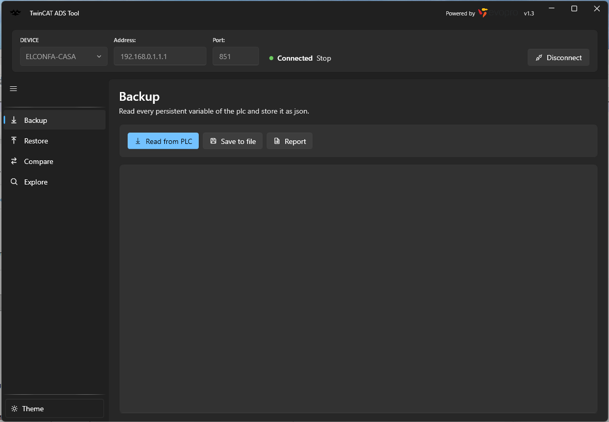

#  TwinCatAdsTool

A fork of [fbarresi/TwinCatAdsTool](https://github.com/fbarresi/TwinCatAdsTool) — the TwinCAT tool
you ever wanted and your lite alternative to Visual Studio.

This fork fixes several defects in the persistent variable backup and restore engine, two of which
could lose data without saying so, and modernises the application: .NET 8, ADS 7 (one binary for
TwinCAT 4024 and 4026) and a Fluent interface.

Everything below is either measured on a real plant or stated as unverified. Where a claim rests on
a measurement, the numbers are given.



Dark by default, with a light theme a click away — the *Theme* button at the foot of the navigation
panel switches between the two without a restart, and the choice is remembered.

---

## Why this fork exists

The first restore attempted against a real PLC reported success and had written only part of the
data. Chasing that down turned up a chain of defects, each hidden behind the previous one, all of
them present in the original code.

The list matters more than the fork: **anyone who has used this tool to restore structured
persistent variables may have a plant that is only partly configured, with no error to show for
it.**

### 1. Restore never wrote structures at all

`IValueSymbol.ReadValueAsync` returns a *result object*, not the value:

```csharp
Task<ResultReadValueAccess> ReadValueAsync(CancellationToken cancel);
```

The writer passed that wrapper straight into the conversion layer, which accepts `object`, so the
compiler had nothing to say. Inside, the cast to `DynamicValue` produced `null`: no members, no
elements, every structure and array treated as a scalar. The restore then reported

```
GVL.PersVarGlobalUser1_1: failed - backup value '' does not fit the plc type
```

for every structured variable. The signature is identical in the 5.x line of the ADS library, so
this defect predates any change made here.

`WriteValueAsync` returns a result too, and its `Succeeded` flag was ignored outright: a write the
PLC refused was counted as a write that worked.

### 2. Values below the first level were written to a copy and lost

This is the serious one, because it reported success.

When the ADS library enters a struct member or an array element, it hands out a **copy** of the
buffer, not a view (`DynamicValueFactory.CreateValue` calls `sourceData.ToArray()`). The old engine
read a whole variable, changed the value tree in memory and wrote the variable back. Anything
written into a nested branch went into a copy nobody ever sent to the PLC — and
`TrySetMemberValue` returns `true` without doing anything for a member that is not primitive, so
nothing failed.

Measured on a live PLC. A backup taken before the restore, and one taken after, with the restore
asking for seven values:

| Variable | Before | Asked for | After | |
|---|---|---|---|---|
| `PersVarGlobalArray` | `[6,7,8,0]` | `[11,22,33,44]` | `[11,22,33,44]` | written |
| `PersVarGlobalUser1_1.Int1` | 157 | 1001 | 1001 | written |
| `.Int2` | 168 | 1002 | 1002 | written |
| `.Bool1` `.Bool2` `.Bool3` | true, true, false | false, false, true | false, false, true | written |
| `.InInVar.IntInIn1` | 12 | **9999** | **12** | **lost** |
| `.InInVar.RealInIn1` | 123.2345 | **999.5** | **123.2345** | **lost** |

The tool reported the whole variable as written.

The boundary is not "arrays work, structures do not": the array of `INT` at the root was written.
What is lost is **everything reached by passing through a non primitive child**.

**The fix.** The engine no longer modifies the value it read in order to write it back.
`PlcLeafPlanner` works out which individual leaves the backup wants written, and each one is
written **to the symbol that owns it**, grouped into sum commands. The value that was read is only
consulted, to learn the declared type of each leaf. The copy is gone from the path rather than
worked around.

Two things fall out of this. The report now names the leaf — `GVL.Var.InInVar.IntInIn1: ads error
...` instead of just the variable — and array elements are addressed **by position** among the
child symbols rather than by a computed index, which removes the `Dimensions mismatch!` failure on
multidimensional arrays in the write path.

The planner is a pure function, so the whole thing is testable without a PLC:
`Tests/TwinCatAdsTool.Logic.Tests/PlcLeafPlannerTests.cs`.

### 3. Structures came back from the PLC as raw bytes

The first backup taken against a real PLC serialised a `User1DUT` as twenty numbers:

```json
"PersVarGlobalUser1_1": [157, 0, 168, 0, 1, 0, 0, 0, 12, 0, 0, 0, 16, 120, 246, 66, 1, 0, 0, 0]
```

The data was all there — `16,120,246,66` is `123.2345` as a little endian REAL — but the shape was
gone, and the report still said `20 ok, 0 failed`.

The symbols were being loaded with `SymbolsLoadMode.VirtualTree`, which hands a STRUCT back as
`byte[]`. Only `SymbolsLoadMode.DynamicTree` produces a `DynamicValue` whose members can be walked.
Verified by reading the same symbol both ways:

| Load mode | Type of the value |
|---|---|
| `VirtualTree` | `System.Byte[]` |
| `DynamicTree` | `DynamicValue` with `Int1, Int2, Bool1, InInVar, Bool2, Bool3` |

What made this hard to see: other structures in the backup looked correct, but they had not been
read as structures. Inside a `STRUCT PERSISTENT` every member is persistent in its own right, so
the scanner picked them up as separate scalars and the JSON object was rebuilt from the paths. A
structure is a single root only when it is the outermost persistent symbol, and that is the only
case where the defect showed.

### 4. TIME, LTIME and TOD did not survive a round trip

Restoring a backup onto the very PLC it came from failed on four variables out of twenty:

```
GVL.ActualLTime: backup value '12.01:26:40.8640000' does not fit the plc type
GVL.PersVarGlobalTime1: backup value '00:00:00.3000000' does not fit the plc type
```

All three types normalise to a `TimeSpan`. JSON has no notion of one, so a backup read back from
disk hands the value over as a string — and `TimeSpan` does not implement `IConvertible`, so the
general `Convert.ChangeType` threw. Timestamps were spared only because Newtonsoft re-parses them
as a date token, already typed.

Also present in the original code, and invisible until a restore finally reached those variables.

### 5. Variables were dropped from the backup without being reported

In the original `PersistentVariableService`, the per-variable `catch` wrote a log line and the
variable **did not go into the JSON**. The file was saved as though it were complete. At restore
time the variable was not there, so nothing was written and there was nothing to report.

Every persistent variable now produces an outcome — written, failed with its ADS error, or skipped
with the reason — and both backup and restore show the report in the interface.

### 6. Logging never wrote a file

`LoggerFactory` lives in `TwinCatAdsTool.Interfaces` and calls `LogManager.GetLogger(name)`, an
overload that resolves the repository from the *calling* assembly. Startup configured the
executable's repository instead, so every logger the application created had no appender at all.

Two more things were in the way. `log.config` was not copied to the publish output, and once it was,
a single file build unpacks bundled content into a temporary folder rather than next to the
executable — so `CopyToPublishDirectory` **and** `ExcludeFromSingleFile` are both needed. And an
appender that cannot open its file keeps the reason to itself, in its own error handler, which
nothing read.

The application now checks that a log file actually appeared and, when it did not, writes
`logging-error.txt` saying why, including the appender's own message. If the folder next to the
executable cannot be written to, everything falls back to `%LOCALAPPDATA%\TwinCatAdsTool` — a
blocked folder used to swallow the log *and* the note explaining its absence.

A missing `log.config` no longer means no log: the executable configures the same rolling file
appender in code. `log.config` stays as an optional override.

---

## What got faster

The original engine delegated to `TwinCAT.JsonExtension`, whose `ReadRecursive` walks down to every
leaf and issues `ReadSymbol` + `ReadValue` for each: **two ADS round trips per leaf**. An
`ARRAY[1..500] OF ST_Dati` with 20 members is 10,000 leaves, so about 20,000 sequential telegrams.
On the client side `iterator.Contains(s.Parent)` inside a `Where` made the scan O(n²).

Each persistent variable is now transferred whole, and variables are grouped into **sum commands**,
which move a batch in one telegram. Sum commands also return a per-symbol error code, which is what
makes the reporting possible at all.

Measured on a real plant:

| Operation | Before | After |
|---|---|---|
| Backup, 71 variables | ~10 minutes | **0.1 s** |
| Restore, 48 variables / 10,978 leaves | — | **2.5 s** |

Writing leaf by leaf means more ADS writes than writing whole variables, which was the obvious
objection to the fix. The measurement settles it: 2.5 seconds for a plant with 465 arrays and 833
structures.

---

## Evidence: a full round trip on a real plant

The strongest check available. A backup of a real installation — **48 persistent variables, 10,978
leaves, nesting up to eight levels deep, 465 arrays, 833 structures**, of which **10,960 leaves lie
below the second level** — was filled with a distinct value per leaf, restored, and backed up again
for a leaf by leaf comparison.

| Run | PLC | Leaves correct | Divergent |
|---|---|---|---|
| 1 | in **Run** | 10,874 / 10,978 | 104 |
| 2 | in **Stop** | **10,978 / 10,978** | **0** |

The 104 in the first run were all of the leaves of `Pers_CC[0]` and `Pers_CC_Axia[0]`, while every
other index of those same arrays was correct, as were index 0 of five other arrays of structures.
No structural rule separates them. What pointed at the answer:
`Pers_CC[0]._Setting._ConteggioCicli` held 105, a value **no leaf in the file asked for** — so it
had not been misplaced, it had appeared on its own. Slot 0 of those two arrays is the working slot
the PLC program keeps cleared.

With the program stopped the divergence disappears entirely.

**A note on method, which cost a wrong conclusion before it was understood:** a backup restored onto
a running PLC cannot be compared leaf by leaf, because what the program writes by itself is
indistinguishable from what the restore would have lost. Verifying the tool needs the PLC stopped.

The generator is in `Tests/ManualVerification/fill_backup.py`. It guarantees two things without
which the comparison proves nothing: **every leaf changes** (a leaf left equal is blind — if the
restore dropped it, the returned backup would match anyway), and **no two sibling leaves get the
same value** (otherwise a swap between neighbours cancels out). Values stay in ranges that fit any
declared PLC type, because the width is not visible from the JSON: integers in 1..127, floats as
whole numbers plus 0.5 (exact even in a single precision REAL, so a difference is an error and not
a rounding), strings of the same length as the original.

Full procedure and results: [docs/RESTORE-VERIFICATION.md](docs/RESTORE-VERIFICATION.md).

---

## Modernisation

### .NET 8

.NET 5 went out of support in May 2022. All four projects now target .NET 8, and
`RuntimeIdentifier` moves from the deprecated `win10-x64` to `win-x64`.

The GUI keeps the `10.0.19041` suffix on purpose: `System.Reactive` only exposes
`ObserveOnDispatcher` for WPF under that target.

`Directory.Build.props` turns on `EnableWindowsTargeting` for non-Windows hosts, so **the WPF
projects build and publish from macOS and Linux** — running them, of course, still needs Windows.

`dotnet test` in CI now runs something. There was no .NET test project in the solution before, so
that step tested nothing; there are now 78 tests covering the backup and restore engine.

### ADS 7: one binary for TwinCAT 4024 and 4026

On a PC with **TwinCAT 4026** the tool could not connect at all, failing with
`AdsException: Cannot register Port '0'` against any target, including the PC itself. The 5.x
library reaches the local router **only over TCP loopback** on `127.0.0.1:48898`, and 4026 changed
that layer. The same executable worked on a 4024 machine, which is what showed the code was not at
fault.

| ADS library | TwinCAT supported |
|---|---|
| 5.x | up to 4024, no support for the 4026 router |
| 6.x | **requires** >= 4024.10 |
| 7.x | **2.11 and later** — covers 4024 and 4026 with one binary |

7.x is therefore the only version that satisfies the requirement, and is what this fork uses.

It took three compilation changes (`DT.Date` → `DT.Value`, the same for `DATE`, a `short` cast in
`DeviceFinder`). The change the compiler does not report is that the PlcOpen types now expose
`DateTime` instead of `DateTimeOffset`. **The offset was an artefact of the wrapper** — a PLC `DT`
carries no time zone — so a backup now records the timestamp as the PLC holds it. The round trip
was verified by running the library: same ticks in and out, and backups produced with 5.x are still
restorable.

### Fluent interface

The views were still the 2019 ones: flat tabs, `Margin="16"` written by hand on every element,
black text boxes with green text, no dark theme. MahApps and Material Design were doing two
overlapping jobs and neither looked like the operating system the application runs on.

The UI is now built on **WPF-UI 4.3.0** (Fluent / WinUI 3): Mica backdrop, `NavigationView` instead
of the tab control, Windows 11 control templates.

**Both a dark and a light theme**, dark being the default. The *Theme* button at the foot of the
navigation panel switches between them with the window open — no restart — and the choice is kept in
`%LOCALAPPDATA%\TwinCatAdsTool`, not next to the executable, which on a cabinet PC is usually not
writable. No colour is a literal in the views: they are all theme lookups, which is what lets the
switch propagate. The plot is the one thing that does not go through the WPF resource system, so it
repaints itself when the theme changes.

Details, and the parts that are deliberately unchanged, in [docs/UI-FLUENT.md](docs/UI-FLUENT.md).

---

## What is verified, and what is not

**Verified on a real PLC**: connection on TwinCAT 4026 with ADS 7; backup of 71 variables in 0.1 s;
restore of 10,978 leaves in 2.5 s with every leaf correct; nested branches, arrays of structures,
arrays inside structures inside arrays, strings, REALs, BOOLs, TIME, LTIME and DT.

**Verified by test**: 78 unit tests, run on every build.

**Not verified**: multidimensional arrays (`ARRAY[0..n,0..m]`), which the plant used for the
verification does not contain. The write path addresses elements by position and can no longer
raise `Dimensions mismatch!`, but whether the backup's flattened form lines up with the order of
the child symbols has not been measured. Test 2 in
[docs/RESTORE-VERIFICATION.md](docs/RESTORE-VERIFICATION.md) covers it.

---

## Download

[**Latest release**](https://github.com/elconfa/TwinCatAdsTool/releases/latest) — two builds of the
same application:

| Asset | When to use it |
|---|---|
| `TwinCatAdsTool-<version>-win-x64-selfcontained.zip` | Nothing to install on the target machine. The obvious choice for a cabinet PC. |
| `TwinCatAdsTool-<version>-win-x64.zip` | Much smaller, but needs the .NET 8 Desktop Runtime already present. |

Unzip and run the executable; no installation. `log.config` beside it is optional — without it the
application logs to `logs\` on its own, and the file is only there for anyone who wants to change
the logging.

Versions follow the tag the release was built from, and the tag sets the version of every assembly,
so what the release is called, what the binary reports and what the window shows are the same
number.

## Reporting a problem

[**Open an issue**](https://github.com/elconfa/TwinCatAdsTool/issues). Bugs and requests for
something new both belong there; the forms ask for the few things a report cannot be acted on
without - TwinCAT version, controller, whether the program was running, and for a restore problem
the shape of the variable involved.

Issues about the original tool rather than about the changes in this fork belong
[upstream](https://github.com/fbarresi/TwinCatAdsTool/issues).

The most useful report anyone could send is a restore onto a plant that uses **multidimensional
arrays**, which is the one case listed above as unverified.

## Requirements

TwinCAT ADS must be installed, and a route to the PLC configured. See
[Beckhoff Information System](https://infosys.beckhoff.com/).

Both TwinCAT 4024 and 4026 are supported by the same build.

## Documentation

| Document | Contents |
|---|---|
| [docs/PERSISTENT-BACKUP-RESTORE.md](docs/PERSISTENT-BACKUP-RESTORE.md) | The backup and restore engine: defects, fixes, design |
| [docs/RESTORE-VERIFICATION.md](docs/RESTORE-VERIFICATION.md) | Field verification procedure and results |
| [docs/UPGRADE-NET8.md](docs/UPGRADE-NET8.md) | .NET 8 and package upgrade, ADS 7 migration |
| [docs/UI-FLUENT.md](docs/UI-FLUENT.md) | The Fluent interface |

## Credits

Original work by [Federico Barresi](https://github.com/fbarresi), MIT licensed, sponsored by
[evopro AG](http://www.evopro-ag.de). This fork keeps the same licence.
